<div align="center">

# ⚡ TEMILOLUWA VALENTINE

```ascii
╔═══════════════════════════════════════════════════════════════╗
║  17 × CS STUDENT × BUILDING TRACELYAI × NIGERIA'S FUTURE ♻️  ║
╚═══════════════════════════════════════════════════════════════╝
```


[](https://www.linkedin.com/in/temiloluwa-valentine-005882293/)
[](https://x.com/temivalentine)
[](mailto:temiloluwa1402@gmail.com)

```javascript
const valentine = {
  status: "🟢 ONLINE",
  mission: "SOLVING_AFRICAS_WASTE_CRISIS",
  progress: { current: X, target: 100, unit: "DAYS" },
  impact: "32M_TONNES_ANNUALLY",
  tech: ["COMPUTER_VISION", "YOLOV8", "REAL_TIME_DETECTION"],
  deployment: "LAGOS_RECYCLING_FACILITIES"
};
```

</div>

---

<div align="center">

## ⚡ SYSTEM STATUS

<table>
<tr>
<td align="center" width="33%">

### 🔴 CRISIS MODE
```yaml
waste: 32M tonnes/year
recycled: <20%
status: CRITICAL
alert: ACTIVE
```

</td>
<td align="center" width="33%">

### 🟡 DEPLOYMENT
```yaml
stage: PROOF_OF_CONCEPT
phase: TRAINING_DATA
day: 32/100
status: BUILDING
```

</td>
<td align="center" width="33%">

### 🟢 SOLUTION
```yaml
ai: COMPUTER_VISION
model: YOLOv8
accuracy: OPTIMIZING
speed: REAL_TIME
```

</td>
</tr>
</table>

</div>

---

<div align="center">

# 🎯 TRACELYAI_SYSTEM.EXE

### `> INITIALIZING WASTE DETECTION PROTOCOL...`

```mermaid
%%{init: {'theme':'dark', 'themeVariables': { 'primaryColor':'#00d9ff','primaryTextColor':'#fff','primaryBorderColor':'#00ff85','lineColor':'#00ff85','secondaryColor':'#ff006e','tertiaryColor':'#1a1a1a'}}}%%
graph LR
    A[📸 SCAN] -->|REAL-TIME| B[🤖 DETECT]
    B -->|AI VISION| C[🎯 CLASSIFY]
    C -->|SORT| D[♻️ RECYCLE]
    D -->|IMPACT| E[🌍 SCALE]
    
    style A fill:#00d9ff,stroke:#00ff85,stroke-width:3px,color:#000
    style B fill:#00ff85,stroke:#00d9ff,stroke-width:3px,color:#000
    style C fill:#ff006e,stroke:#00d9ff,stroke-width:3px,color:#fff
    style D fill:#ffb800,stroke:#00ff85,stroke-width:3px,color:#000
    style E fill:#00d9ff,stroke:#ff006e,stroke-width:3px,color:#000
```


</div>



<div align="center">

### 🎬 LIVE_DEMO.MP4

[](https://youtube.com/shorts/RFjJ0TAUlVM?si=UScNILbmCq4xMvZB)
[](https://github.com/Valentinetemi/tracely-ai)
[](https://www.linkedin.com/in/temiloluwa-valentine-005882293/)

</div>

---

<div align="center">

## 🔮 NEURAL_TECH_STACK

### AI × ML CORE


### INTERFACE LAYER


### QUANTUM TOOLS


</div>

---

<div align="center">

## 📊 SYSTEM_METRICS.JSON


</div>

---

<div align="center">

## 🎯 MISSION_OBJECTIVES.LOG

```python
class MissionControl:
    def __init__(self):
        self.objectives = {
            "Q1_2025": [
                {"task": "NIGERIAN_DATASET", "target": "5K_IMAGES", "status": "🔄"},
                {"task": "LAGOS_DEPLOYMENT", "target": "PILOT_FACILITY", "status": "⏳"},
                {"task": "CLIMATE_GRANT", "target": "FUNDING_SECURED", "status": "⏳"}
            ],
            "Q2_2025": [
                {"task": "SOCIAL_REACH", "target": "10K_FOLLOWERS", "status": "📈"},
                {"task": "MODEL_ACCURACY", "target": "95%_PRECISION", "status": "🔄"}
            ],
            "2026": [
                {"task": "100_DAYS_AI", "target": "COMPLETION", "status": "DAY_X/100"}
            ]
        }
    
    def calculate_progress(self):
        return "TRAJECTORY: OPTIMAL ✓"
```

</div>

<div align="center">

| 🎯 OBJECTIVE | ⚡ STATUS | 📅 ETA |
|:------------|:---------:|:------:|
| 📸 DATASET: 5K+ NIGERIAN WASTE IMAGES |  | Q1 2025 |
| 🭠DEPLOY: LAGOS RECYCLING FACILITY |  | Q1 2025 |
| 💰 SECURE: CLIMATE TECH FUNDING |  | Q1 2025 |
| 📱 REACH: 5K LINKEDIN NETWORK |  | Q2 2025 |
| ✅ COMPLETE: #100DAYSOFAI |  | JAN 2026 |

</div>

---

<div align="center">

## 🌐 CONNECT_TO_NETWORK

```bash
$ npm install @valentine/tracelyai
$ connect --protocol="collaboration"
$ activate --mode="build-together"
```

<br/>

[](https://www.linkedin.com/in/temiloluwa-valentine-005882293/)
[](https://x.com/temivalentine)
[](mailto:temiloluwa1402@gmail.com)

<br/>


### 💭 MISSION_STATEMENT.TXT

> **"TRANSFORMING WASTE INTO WEALTH THROUGH AI."**  
> **"MAKING RECYCLING ECONOMICALLY VIABLE IN NIGERIA."**  
> **"ONE DETECTION. ONE SORT. ONE FUTURE. ♻️"**

<br/>

```ascii
┌─────────────────────────────────────────────────────────────┐
│  BUILDING THE FUTURE OF NIGERIA'S CIRCULAR ECONOMY          │
│  REAL-TIME AI × COMPUTER VISION × SUSTAINABLE IMPACT        │
│  JOIN THE MISSION: STAR ⭐ × FORK 🔱 × CONTRIBUTE 🤝       │
└─────────────────────────────────────────────────────────────┘
```

<br/>


<br/>


</div>
